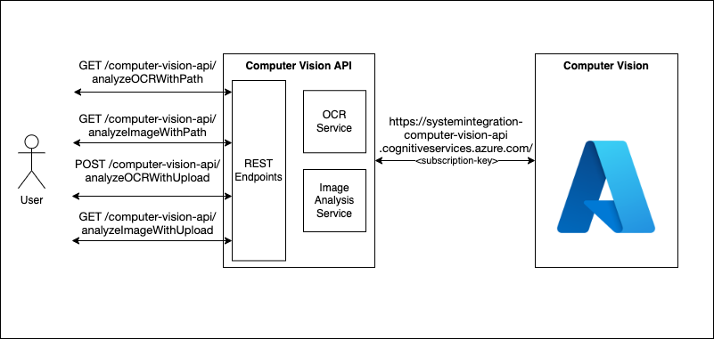
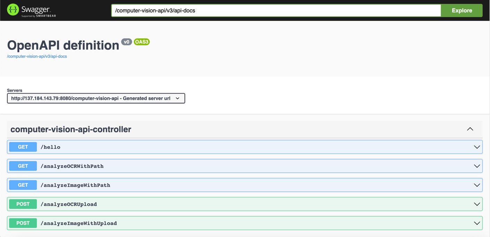
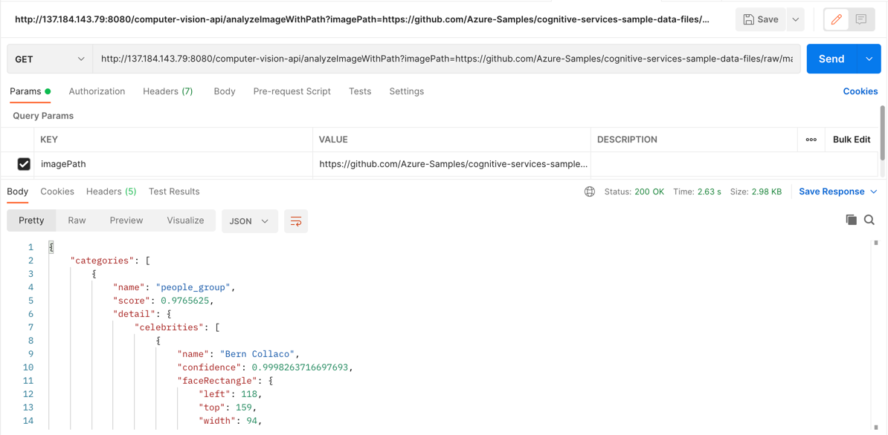

<h1 align="center">Computer Vision Api</h1>

<h2 align="center">About The Application</h2>
This application provides api for Optical character recognition (OCR) and Image Analysis.<br />

### OCR Overview
Optical character recognition (OCR) allows you to extract printed or handwritten text from images, such as photos of street signs and products, as well as from documents—invoices, bills, financial reports, articles, and more.<br />
[Additional Resource](https://docs.microsoft.com/en-us/azure/cognitive-services/computer-vision/overview-ocr)

### Image Analysis Overview
The Computer Vision Image Analysis service can extract a wide variety of visual features from your images. For example, it can determine whether an image contains adult content, find specific brands or objects, or find human faces.<br />
[Additional Resource](https://docs.microsoft.com/en-us/azure/cognitive-services/computer-vision/overview-image-analysis)

### Image requirements
- The image must be presented in JPEG, PNG, GIF, or BMP format
- The file size of the image must be less than 4 megabytes (MB)
- The dimensions of the image must be greater than 50 x 50 pixels

## Architecture Diagram:
 <br />

-------------------------------------------------------------------

## Application Tech Stack
- JAVA
- Spring Boot
- Gradle

## API Reference
#### Get Optical character recognition for Image

```http
  GET /computer-vision-api/analyzeOCRWithPath
```

| Parameter | Type     | Description                |
| :-------- | :------- | :------------------------- |
| `imagePath` | `string` | **Required**. Your Image Path |

#### Get Image Analysis for Image

```http
  GET /computer-vision-api/analyzeImageWithPath
```

| Parameter | Type     | Description                |
| :-------- | :------- | :------------------------- |
| `imagePath` | `string` | **Required**. Your Image Path |

```http
  POST /computer-vision-api/analyzeOCRUpload
```

| Parameter | Type     | Description                |
| :-------- | :------- | :------------------------- |
| `file` | `file` | **Required**. Your Image File |

```http
  POST /computer-vision-api/analyzeImageWithUpload
```

| Parameter | Type     | Description                |
| :-------- | :------- | :------------------------- |
| `file` | `file` | **Required**. Your Image File |

## How to use API
- Command line (example: curl -X 'GET' \
  'http://137.184.143.79:8080/computer-vision-api/analyzeImageWithPath?imagePath=<imagepath>')
- Swagger Interface <details><summary>Click to expand!</summary>  </details>
- Postman App <details><summary>Click to expand!</summary>  </details>

## Application Swagger link
[Computer Vision Api Swagger link](http://137.184.143.79:8080/computer-vision-api/swagger-ui/index.html) <br />

<details>
  <summary>Click to expand!</summary>


</details>

## Run Application Locally
Clone the project
```bash
  git clone https://github.com/sbidikar/ComputerVisionApi.git
```
Go to the project directory
```bash
  cd ComputerVisionApi
```
Start the server

```bash
  ./gradlew bootRun
```

## Troubleshooting & FAQ
- If Java is Not installed on system </br>
[Install Java](https://www.java.com/en/download/help/download_options.html) <br />
- To install Postman to test application follow link below </br>
[Postman](https://www.postman.com/downloads/)

## Authors

- [@sbidikar](https://github.com/sbidikar)

## Support
For support, email sbidikar@uncc.edu

## Contributing

Contributions are always welcome!

See `contributing.md` for ways to get started.

Please adhere to this project's `code of conduct`.

## Feedback

If you have any feedback, please reach out to us at sbidikar@uncc.edu

## 🚀 About Me
I'm a full stack Software Engineer at Lowe's Inc with 9+ years of Software Industry experience.

## 🔗 Links
[](https://www.linkedin.com/in/siddharth-bidikar/)


